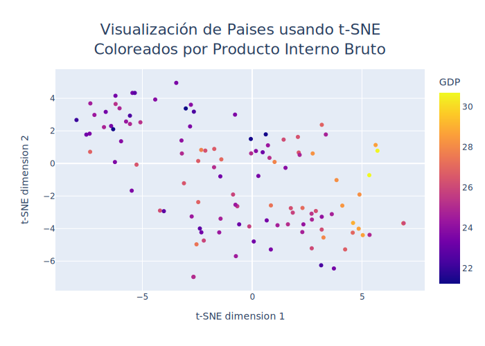
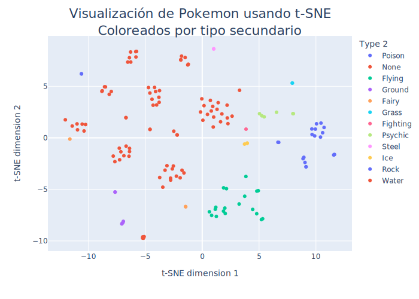

# Visualización de datos usando t-SNE
Se realizan visualizaciones de datos multidimensionales en gráficos 2D y 3D usando el algoritmo t-SNE (*t-Distributed Stochastic Neighbor Embedding*)
sobre 3 *datasets* distintos:

- **Dataset de dígitos**: Correspondiente a imágenes de dígitos entre 0 y 9 escritos a mano (similar a MNIST). 
- **Dataset de paises**: Cada *datapoint* corresponde a un país, con estadísticas como GDP, población, área, etc.
- **Dataset de pokemons**: Cada *datapoint* correponde a un pokemon de la 1° generación, con sus estadisticas en videojuegos como características.
  
Sobre cada *dataset* se procede de manera símilar:
- Se importan librerías y datos.
- Se preprocesan los datos.
- Se importa y entrena un modelo t-SNE de Scikit Learn.
- Se visualizan los resultados.

# Visualización de Dígitos

Código implementado y explicado en detalle en **Visualización de Dígitos.ipynb**.

## Importación de datos y librerías
- Se importan las librerías:
  - Numpy 
  - Matplotlib
- Los datos se importan directamente de Scikit Learn:
  - from sklearn.datasets import load_digits

## Preprocesamiento de datos
- Los datos disponibles tienen dimensiones (1797, 64):
  - Hay 1797 *datapoint* cada uno correspondiente a un dígito entre 0 y 9 escrito a mano.
  - Cada *dataponit* corresponde a una imagen de 8x8 pixeles, aplanado a un vector de 64 componentes.
  - Cada pixel es un valor entre 0 y 255.
- Los datos además contienen la etiqueta correcta del número representado, lo que servirá para evaluar los resultados.
- No se requiere realizar transformaciones sobre los datos.

## t-SNE

- Se importa t-SNE desde Scikit-Learn.
- Se declara modelo con *n_components = 2*.
- Se transforman los datos, obteniendo representación con 2 componentes

## Visualización de resultados

- Se grafica cada *datapoint* en un gráfico tipo *scatter* usando *pyplot* de Matplotlib.
- Se grafican las etiquetas de los números sobre los cúmulos para una visualización más fácil.

</img>

- En el gráfico se colorea cada *datapoint* según la etiqueta real.
- Se puede ver que el algoritmo t-SNE separa de manera satisfactoria los dígitos distintos en cúmulos claramente diferenciados entre ellos.

# Visualización de Paises

## Importación de datos y librerías
- Se importan las librerías:
  - Numpy 
  - Pandas
  - Plotly
- Los datos se obtuvieron de Kaggle:  
  - [Global Country Information Dataset 2023](https://www.kaggle.com/datasets/nelgiriyewithana/countries-of-the-world-2023)

## Preprocesamiento de datos
- Se tienen estadísticas de 195 paises.
- Se eliminan los paises con datos faltantes y se reduce a 110 paises.
- Se dejan solo las características numéricas.
- Se limpian y transforman datos numericos en formato *string* a *float*. 
- Se normaliza usando Min-Max.

## t-SNE

- Se importa t-SNE desde Scikit-Learn y se declara modelo con *n_components = 2*.
- Se transforman los datos, obteniendo representación con 2 componentes

## Visualización de resultados
- Se usa la librería Plotly para generar gráficos interactivos.
- Al colocar cursor sobre *datapoint* se muestra *pop-up* con todos los datos del país.
- A continuación se muestra una imagen plana, pero al cliquearla se abre el gráfico intereactivo en otra pestaña.

[</img>](https://rhoffmannv.github.io/t-sne/html/paises_by_gdp_text.html)

Ver gráfico interactivo [aquí 📊](https://rhoffmannv.github.io/t-sne/html/paises_by_gdp_text.html)

# Visualización de Pokemons

</img>   
Ver gráfico interactivo [aquí 📊](https://rhoffmannv.github.io/t-sne/html/by_type_text.html)

</img>

Ver gráfico interactivo [aquí 📊](https://rhoffmannv.github.io/t-sne/html/by_type_2_text.html)

